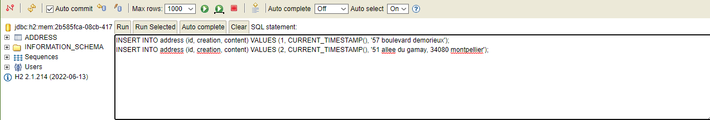
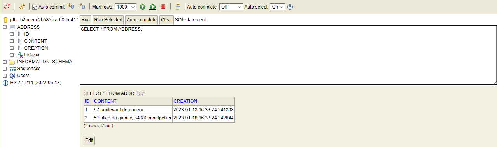

# Readme.md

## Description des dépendances

JPA : Ajoute la persistance des données SQL avec JAVA et Spring.

Hibernate : Framework, gère la persistance des données en Base de données relationnelles.

Spring : Framework de développement Java, utilise le modèle MVC pour simplifier le développement d'une application JAVA.

Spring Boot : Ajoute des fonctionnalités orientées Web à Spring.

H2 : Framework de gestion de base de données grâce à JAVA.

Thymeleaf : Framework, permet de faciliter la gestion des données dynamiques d'une page web avec Spring.

---

Réponses aux questions : 

###### Etape 13 :

    1./ @RequestParam(name="nameGET", required=false, defaultValue="World") String nameGET, Model model)

    2./ @GetMapping("/greeting")

    3./ En utilisant GET.

###### Etape 17 :

Dans le volet à gauche de l'écran est apparu la table ADDRESS.

###### Etape 18:

En ajoutant l'annotation @Entity, on indique à Spring que la classe Address est une entité 
de notre base de données (ou une table).

###### Etape 20:

En insérant les données depuis l'interface h2 :

On peut observer qu'elles sont bien insérées dans la base : 

Pour faire apparaître les données dans la base depuis le fichier data.sql,
il faut rajouter la commande suivante dans le fichier application.properties. 

    spring.jpa.defer-datasource-initialization=true

###### Etape 22:

@Autowired sert à réaliser les injections de dépendances automatiques (injecter des beans dans notre propre bean).

###### Etape 27:

Oui, c'est possible.

##### Etape 30:

Dans le fichier pom.xml, on rajoute les dependencies liées à Bootstrap : 

    <dependency>
        <groupId>org.webjars</groupId>
        <artifactId>bootstrap</artifactId>
        <version>3.3.6</version>
    </dependency>
    <dependency>
        <groupId>org.webjars</groupId>
        <artifactId>bootstrap-datepicker</artifactId>
        <version>1.0.1</version>
    </dependency>

Il suffit ensuite d'ajouter la balise link dans le header.html pour utiliser les fonctionnalités de Bootstrap.

      <link href="webjars/bootstrap/3.3.6/css/bootstrap.min.css" rel="stylesheet">

Ou, on peut directement importer Bootstrap comme indiqué dans la doc du framework :

    <link href="https://cdn.jsdelivr.net/npm/bootstrap@5.3.0-alpha1/dist/css/bootstrap.min.css" rel="stylesheet" integrity="sha384-GLhlTQ8iRABdZLl6O3oVMWSktQOp6b7In1Zl3/Jr59b6EGGoI1aFkw7cmDA6j6gD" crossorigin="anonymous">

---